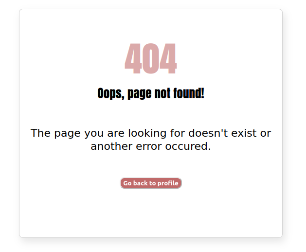

# 404-page
Becode exercise : learn semantic HTML and CSS positioning : create an error 404 page

)

## Briefing
[Instructions](https://github.com/becodeorg/CRL-KELLER-6/blob/main/1.TRAIL/1.The-Field/4.HTML-CSS/0.fundamentals/05-error-404.md) for the exercise.

## Used languages
HTML5 and CSS3

## Authors
Virginie Dourson

## Date
08/2023

## Progression
Finished

## Link
https://vdourson2.github.io/404-page/